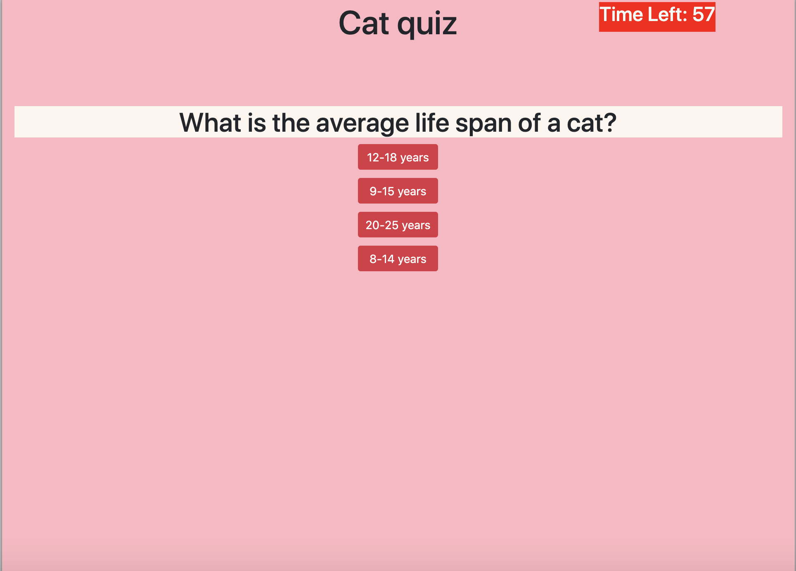

# coding-quiz 
Instructions: 
. You have one minute (60seconds) to complete this cat trivia! 
. Each time you answer the question incorrectly 10 seconds will be deducted from your time 
. If you answer correctly your timers seconds will not be affected 
. Your final score will be equal to however many seconds you have left on the timer 
. Good luck cat lovers! 

DEPLOYED URL: https://rachelsakles.github.io/coding-quiz/
